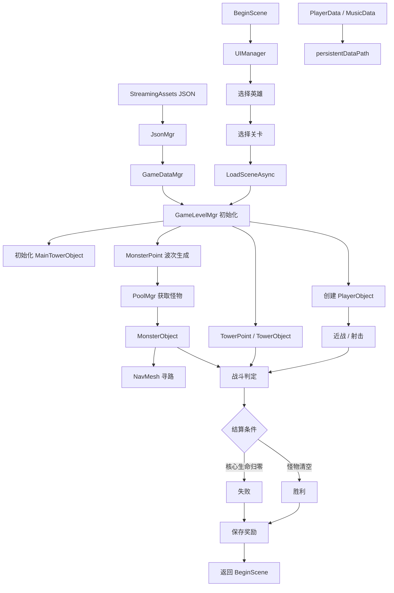

# Zombie Siege

基于 **Unity 2022.3 LTS** 开发的第三人称 3D 塔防 Demo。

玩家既可以直接控制英雄进行近战或射击，也可以在固定建造点部署、升级防御塔，与不断生成的丧尸共同争夺战场，保护地图中央的核心区域。

> 当前项目版本：`1.0`
> Unity 版本：`2022.3.62f3`

---

## 项目特色

* 第三人称角色移动、转向、翻滚、近战与射击
* 6 名可选英雄，支持金币解锁
* 3 个可游玩关卡
* 基于 NavMesh 的丧尸寻路与波次生成
* 加农炮、机枪炮、魔法炮 3 条建造路线，每类可升级至 3 级
* 防御塔支持单体与范围两种攻击模式
* Animator + Animation Event 驱动战斗关键帧判定
* 基于 Unity `ObjectPool<T>` 的怪物、特效及临时音效复用
* Physics NonAlloc 查询与集合复用，降低战斗高频路径的 GC Alloc
* JSON 配置角色、怪物、关卡、防御塔数值及资源路径
* 玩家金币、英雄解锁状态及音频设置本地持久化
* 使用 Unity Profiler / Profile Analyzer 对性能优化进行分阶段验证

---

## 运行架构



---

## 核心技术实现

### 对象池与生命周期管理

战斗过程中会持续创建怪物、攻击特效及临时音效。如果直接频繁调用 `Instantiate / Destroy`，容易产生额外的对象创建销毁开销和运行时内存分配。

项目基于 Unity `ObjectPool<T>` 封装 `PoolMgr`：

```text
Resources Path
      ↓
Dictionary<string, ObjectPool<GameObject>>
      ↓
PoolMgr.GetObj()
      ↓
对象运行
      ↓
PoolMgr.PushObj()
      ↓
对象回池
```

当前主要池化对象包括：

* 波次怪物
* 玩家射击命中特效
* 防御塔攻击特效
* 临时 AudioSource

不同 Resources 路径对应独立对象池，`PoolObject` 记录对象归属，并负责延迟回收、重复回收保护以及粒子、音频状态恢复。

怪物对象再次从池中取出时，还需要额外恢复业务状态：

```text
HP
死亡标记
攻击计时
Animator 状态
NavMeshAgent 状态
移动与转向参数
```

`MonsterObject.InitInfo()` 中通过 `Animator.Rebind()`、重新启用 `NavMeshAgent` 等方式避免对象复用产生状态污染。

临时音效使用独立 `ObjectPool<SoundObject>` 管理，同时通过 Dictionary 缓存已经加载的 `AudioClip`。

---

### GC Alloc 与物理查询优化

玩家攻击、怪物攻击和防御塔索敌属于高频执行路径。

为减少物理查询过程中产生的临时结果对象，项目将相关检测改为 Unity Physics NonAlloc API：

```text
Physics.OverlapSphere
        ↓
Physics.OverlapSphereNonAlloc

Physics.SphereCast
        ↓
Physics.SphereCastNonAlloc
```

并提前分配：

```csharp
Collider[]
RaycastHit[]
```

作为查询结果缓冲区。

防御塔 AOE 索敌同样复用成员 `List<MonsterObject>`，通过 `Clear()` 后重新填充目标，避免高频创建新的 List。

#### Profiler 测试结果

使用 Unity Profiler 与 Profile Analyzer 对优化过程进行分阶段采样。

在固定的 300 帧采样窗口内，对单次攻击路径产生的 GC Alloc 进行比较：

| 测试场景  | 优化阶段        |    GC Alloc |
| ----- | ----------- | ----------: |
| 枪械命中  | 对象池版本       | 中位数 `168 B` |
| 枪械命中  | NonAlloc 版本 |  中位数 `92 B` |
| 防御塔攻击 | 优化前         | 典型值 `120 B` |
| 防御塔攻击 | 对象池 / 集合复用后 |  典型值 `66 B` |

最终结果：

```text
枪械命中：168 B → 92 B，降低约 45%

防御塔攻击：120 B → 66 B，降低约 45%
```

该优化主要针对战斗高频路径中的临时内存分配，而对象池则主要用于降低怪物、特效及临时音效的频繁创建和销毁。

---

### Animator + Animation Event 战斗时序

角色输入不会直接进行伤害结算，而是首先驱动 Animator：

```text
Input
  ↓
Animator Trigger / Parameter
  ↓
攻击动画
  ↓
Animation Event
  ↓
物理检测
  ↓
伤害结算
```

玩家近战和射击分别在攻击动画关键帧调用：

```text
KnifeEvent
ShootEvent
```

从而使伤害判定时机和实际攻击动作保持一致。

怪物同样利用 Animation Event 管理生命周期：

```text
出生动画
   ↓
BornOver
   ↓
NavMeshAgent.SetDestination

攻击动画
   ↓
AtkEvent
   ↓
核心区域受到伤害

死亡动画
   ↓
DeadEvent
   ↓
移出怪物列表
   ↓
胜利检测
   ↓
对象池回收
```

这种方式将输入、动画表现和实际伤害时机进行拆分，使攻击逻辑与动画关键帧同步。

---

### JSON 数据驱动

角色、怪物、场景及防御塔主要参数统一配置在 `Assets/StreamingAssets` 中。

```text
StreamingAssets JSON
        ↓
JsonMgr
        ↓
GameDataMgr
        ↓
Gameplay
        ↓
Resources.Load
```

配置不仅包含战斗数值，还包括 Resources 相对路径、Animator、Sprite 和战斗特效等资源信息。

防御塔升级关系通过 `nextLev` 配置：

```text
加农炮
1 → 2 → 3

机枪炮
4 → 5 → 6

魔法炮
7 → 8 → 9
```

从而使三条炮塔升级路线能够复用同一套建造和升级流程。

项目使用 LitJson 进行序列化与反序列化；LitJson 本身为第三方库，项目主要对其数据加载和持久化流程进行了封装。

---

## 游戏流程

一局游戏的基本流程如下：

1. 在主菜单选择英雄，部分英雄需要使用累计金币解锁。
2. 从三个关卡中选择地图进入游戏。
3. 玩家直接攻击不断生成的丧尸。
4. 靠近建造点后可以建造或升级防御塔。
5. 击杀怪物获得局内金币。
6. 清除全部波次后完成关卡；核心区域生命值归零则挑战失败。
7. 结算奖励加入玩家总金币并保存到本地。

---

## 游戏内容

### 英雄

项目配置了 6 名可选英雄。

角色数据位于：

```text
Assets/StreamingAssets/RoleInfo.json
```

主要配置：

```text
资源路径
攻击力
展示名称
解锁费用
攻击类型
命中特效
```

---

### 关卡

| 关卡   | Scene        | 初始局内金币 | 核心生命值（当前配置） |
| ---- | ------------ | -----: | ----------: |
| 疯狂树林 | `GameScene1` |    200 |         200 |
| 极寒雪地 | `GameScene2` |    200 |         100 |
| 熔岩旱土 | `GameScene3` |    200 |        9999 |

关卡配置位于：

```text
Assets/StreamingAssets/SceneInfo.json
```

---

### 防御塔

| 类型  | 攻击方式 | 特点          | 等级 |
| --- | ---- | ----------- | -: |
| 加农炮 | 单体   | 较高单次伤害      |  3 |
| 机枪炮 | 单体   | 较短攻击间隔      |  3 |
| 魔法炮 | 范围   | 同时攻击范围内多个目标 |  3 |

价格、攻击力、攻击范围、攻击间隔、升级关系、Prefab 和特效路径均由：

```text
Assets/StreamingAssets/TowerInfo.json
```

进行配置。

---

## 操作说明

| 操作   | 按键                       |
| ---- | ------------------------ |
| 移动   | `W` `A` `S` `D` 或方向键     |
| 转向   | 鼠标水平移动                   |
| 攻击   | 鼠标左键                     |
| 下蹲   | 左 `Shift`                |
| 翻滚   | `R`                      |
| 建造炮塔 | 靠近空建造点后按 `1` / `2` / `3` |
| 升级炮塔 | 靠近可升级炮塔后按空格键             |

---

## 技术栈

* Unity `2022.3.62f3`
* C#
* UGUI / TextMesh Pro
* Unity AI Navigation / NavMesh
* Animator / Root Motion / Animation Event
* Unity `ObjectPool<T>`
* Physics NonAlloc API
* Resources 动态资源加载
* LitJson
* Unity Profiler / Profile Analyzer
* Unity Input Manager

---

## 项目结构

```text
Assets/
├─ ArtRes/                     # 原始配置、美术及第三方资源
│
├─ Resources/                  # Resources.Load 动态加载资源
│  ├─ Animator/
│  ├─ Monster/
│  ├─ Role/
│  ├─ Tower/
│  ├─ Music/
│  ├─ eff/
│  └─ UI/
│
├─ Scenes/
│  ├─ BeginScene.unity
│  ├─ GameScene1.unity
│  ├─ GameScene2.unity
│  └─ GameScene3.unity
│
├─ Scripts/
│  ├─ Main.cs
│  │
│  ├─ BeginScene/              # 主菜单、选角、选关与设置
│  │
│  ├─ Data/                    # 游戏数据结构与 GameDataMgr
│  │
│  ├─ GameScene/               # 战斗、波次、玩家、怪物与炮塔
│  │
│  ├─ Json/                    # JsonMgr 与 LitJson
│  │
│  ├─ Pool/                    # 对象池与临时音效
│  │  ├─ PoolMgr.cs
│  │  ├─ PoolObject.cs
│  │  └─ SoundObject.cs
│  │
│  └─ UI/                      # UIManager 与 BasePanel
│
└─ StreamingAssets/
   ├─ MonsterInfo.json
   ├─ RoleInfo.json
   ├─ SceneInfo.json
   └─ TowerInfo.json
```

---

## 核心模块

| 模块                      | 职责                          |
| ----------------------- | --------------------------- |
| `GameDataMgr`           | 管理角色、怪物、场景、防御塔、玩家和音频数据      |
| `JsonMgr`               | JSON 配置读取及本地数据持久化           |
| `UIManager / BasePanel` | UI 动态创建、查询、淡入淡出与销毁          |
| `GameLevelMgr`          | 玩家初始化、怪物记录、波次信息、索敌与胜利检测     |
| `MonsterPoint`          | 按波次及时间间隔生成怪物                |
| `PlayerObject`          | 玩家输入、Animator 参数及近战/射击判定    |
| `MonsterObject`         | NavMesh 寻路、攻击、受伤、死亡与对象池状态恢复 |
| `TowerPoint`            | 防御塔建造及升级交互                  |
| `TowerObject`           | 自动索敌、炮头旋转、单体/AOE 攻击         |
| `MainTowerObject`       | 核心区域生命值与失败逻辑                |
| `PoolMgr`               | 管理怪物、特效和临时音效对象池             |
| `PoolObject`            | 对象池归属、延迟回收及粒子/音频状态恢复        |
| `SoundObject`           | 临时 AudioSource 播放与自动回池      |

---

## 数据配置

### 静态游戏配置

```text
Assets/StreamingAssets/
```

| 文件                 | 内容                     |
| ------------------ | ---------------------- |
| `RoleInfo.json`    | 英雄属性、资源路径、解锁费用及命中特效    |
| `SceneInfo.json`   | 关卡信息、Scene、初始金币及核心生命值  |
| `MonsterInfo.json` | 怪物攻击、生命、移动参数及 Animator |
| `TowerInfo.json`   | 炮塔价格、攻击参数、升级链及资源路径     |

### 玩家运行数据

运行过程中产生的数据保存在：

```csharp
Application.persistentDataPath
```

主要包括：

```text
PlayerData.json
MusicData.json
```

用于保存：

```text
累计金币
已解锁英雄
背景音乐设置
音效设置
音量设置
```

---

## 快速开始

### 环境

* Unity Hub
* Unity Editor `2022.3.62f3`
* Windows 开发环境
* Git LFS

如果通过 Git 获取项目，请确保仓库中的 LFS 资源已经正确拉取。

打开项目后：

```text
Assets/Scenes/BeginScene.unity
```

点击 Play 即可从主菜单开始游戏。

Build Settings 中启用的 Scene 顺序：

```text
0. Assets/Scenes/BeginScene.unity
1. Assets/Scenes/GameScene1.unity
2. Assets/Scenes/GameScene2.unity
3. Assets/Scenes/GameScene3.unity
```

---

## 开发约定

* UI 面板脚本类名需要与 `Assets/Resources/UI` 下对应 Prefab 名称保持一致。
* 配置中的 `res`、`animator`、`imgRes`、`eff` 等字段均为相对于 `Assets/Resources` 的路径，且不包含扩展名。
* 当前部分配置使用 `id - 1` 映射 List 索引，因此对应 ID 需要从 1 开始、保持连续并按顺序排列。
* 新增关卡后需要同步更新 `SceneInfo.json` 与 Unity Build Settings。
* 怪物需要正确配置 NavMesh、Animator、Layer 和 Animation Event。
* 新增池化对象时，需要确保其运行时状态能够在再次取出时正确恢复。

---

## 许可说明

本仓库当前未声明开源许可证。

除非项目所有者另行授权，否则请勿复制、分发或用于商业用途。项目中的模型、动画、字体、音效、特效及其他第三方资源，其授权情况以对应原始资源来源为准。
